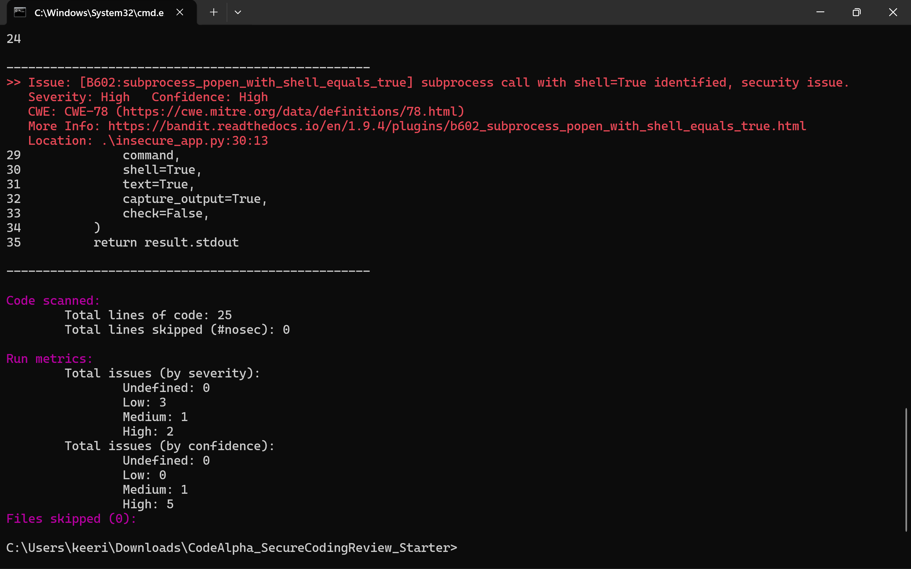

# Secure Coding Review - Python Demo Application

## CodeAlpha Cyber Security Internship - Task 3

**Prepared by:** Keerit Kapoor
**Project:** Secure Coding Review

---

## Overview

This project reviews a local Python demo application for common secure-coding weaknesses. It contains an intentionally insecure example, a hardened rewrite, manual review notes, a Bandit static-analysis scan, and a formal security review report.

> **Safety note:** `insecure_app.py` is intentionally vulnerable for educational code-review practice only. Do not deploy it or run it with untrusted input.

---

## Objectives

* Review Python source code for common security weaknesses.
* Use Bandit static analysis to support manual code inspection.
* Document findings, risk levels, and remediation steps.
* Demonstrate safer coding patterns in a hardened version of the application.

---

## Files

| File                                            | Purpose                                           |
| ----------------------------------------------- | ------------------------------------------------- |
| `insecure_app.py`                               | Intentionally insecure local demo used for review |
| `secure_app.py`                                 | Hardened rewrite demonstrating safer patterns     |
| `requirements.txt`                              | Dependency list for Bandit                        |
| `review_notes.md`                               | Manual-review findings and remediation guidance   |
| `Video_Script.txt`                              | Script for the LinkedIn project-explanation video |
| `Security_Code_Review_Report_Keerit_Kapoor.pdf` | Final security code-review report                 |
| `screenshots/bandit_scan_summary.png`           | Bandit static-analysis evidence                   |

---

## Findings Summary

| ID    | Finding                                        | Severity | Recommended Fix                                          |
| ----- | ---------------------------------------------- | -------: | -------------------------------------------------------- |
| SC-01 | Hard-coded password                            |   Medium | Use environment variables or managed secret storage      |
| SC-02 | Weak MD5 password hashing                      |     High | Use PBKDF2, bcrypt, scrypt, or Argon2 with a unique salt |
| SC-03 | Unsafe `pickle` deserialization                |     High | Use JSON and validate the expected structure             |
| SC-04 | Shell command injection risk from `shell=True` |     High | Use allow-listed arguments and `shell=False`             |

---

## Static Analysis Evidence



The Bandit scan reported 2 High, 1 Medium, and 3 Low severity findings. One confirmed high-severity result is B602, which flags a subprocess call that uses `shell=True`.

### Reproduce the Scan

```powershell
py -m pip install -r requirements.txt
py -m bandit -r insecure_app.py
```

Bandit reads the source code and does not execute the intentionally insecure demo functions.

---

## Secure Improvements Demonstrated

The hardened `secure_app.py` demonstrates:

* No hard-coded credentials in source code
* PBKDF2-HMAC-SHA256 with a random salt for password handling
* JSON parsing instead of unsafe `pickle` deserialization
* Allow-listed diagnostic commands
* `shell=False`, timeout handling, and explicit subprocess arguments

---

## Full Report

[Open the Secure Coding Review Report](Security_Code_Review_Report_Keerit_Kapoor.pdf)

---

## Disclaimer

This repository is an educational, local-only code-review project created for the CodeAlpha Cyber Security Internship. No live systems, external targets, user data, or unauthorised testing are involved.

